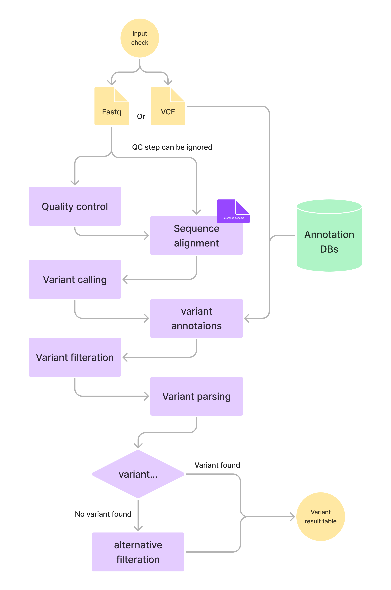

# cpu-based-ngs-workflow
A computational pipeline designed for automated processing of Next-Generation Sequencing (NGS) data using CPU resources. 

## functionalities 

- Dynamic directory building 
- Passing the userID and jobID through the pipeline 
- Logging each step and error handling 
- Skipping each step if it has previously run (for killed runs)
- Flag to skip the QC step
- Conditionally start the pipeline based on the kind of inputs
- Conditionally alternative variant filtering and parsing

